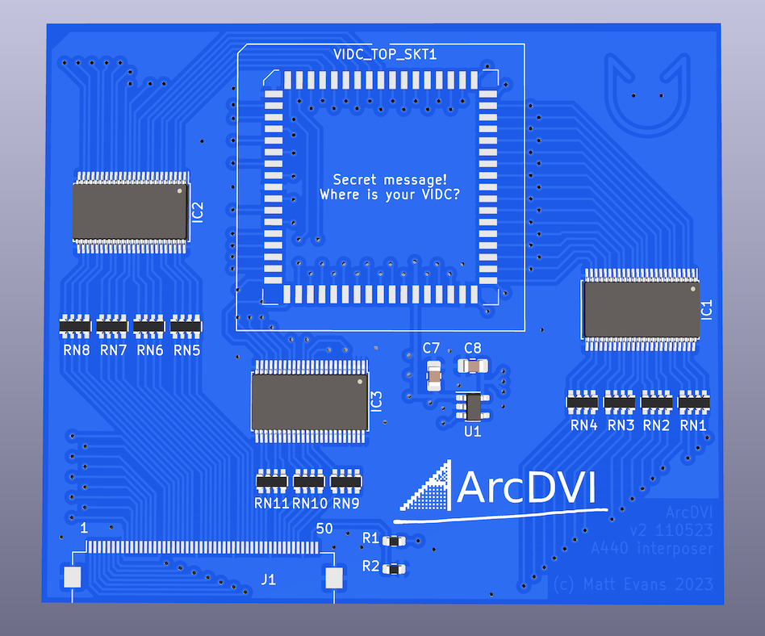

# ArcDVI VIDC socket interposer PCB

Kicad 6.0 PCB design for the ArcDVI VIDC socket interposer board:

This board carries a PLCC68 socket on top, and PLCC68 plug on bottom.  It plugs into VIDC's socket on an Archimedes A440-like machine, with VIDC moved to the socket on top, and exports the buffered signals over FFC to the ArcDVI main PCB.

See <https://stardot.org.uk> for more info.

# License

ArcDVI is copyright 2023 Matt Evans.

This work is licensed under the Creative Commons Attribution-NonCommercial-ShareAlike 3.0 Unported License. To view a copy of this license, visit http://creativecommons.org/licenses/by-nc-sa/3.0/ or send a letter to Creative Commons, PO Box 1866, Mountain View, CA 94042, USA.
